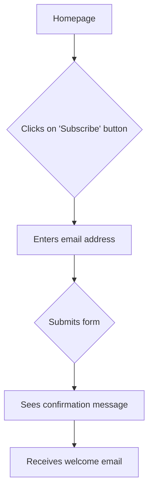

## Workflow

1.  **Define the Goal:** Clearly state the objective of the user flow you want to map. For example, "User completes the checkout process."
2.  **Identify Entry Points:** Determine how users enter the flow (e.g., from the homepage, a marketing email, or a direct link).
3.  **Map the Steps:** Outline each action the user takes to move through the flow. Include decision points, branches, and potential dead ends.
4.  **Visualize the Flow:** Use a diagramming tool or a simple text-based representation to create a visual map of the user flow.
5.  **Analyze and Optimize:** Identify areas for improvement, such as simplifying steps, reducing friction, or clarifying navigation.

## Usage

To use this skill, provide a clear description of the user flow you want to map. The agent will then generate a visual representation of the flow, which can be used for analysis and optimization.

## Example

**User Request:** "Map the user flow for a new user signing up for our newsletter."

**Agent Output:**

